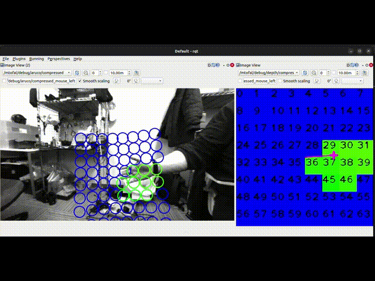
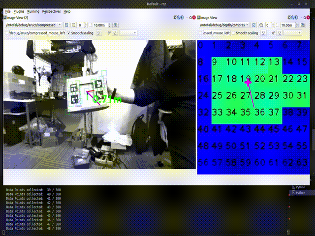
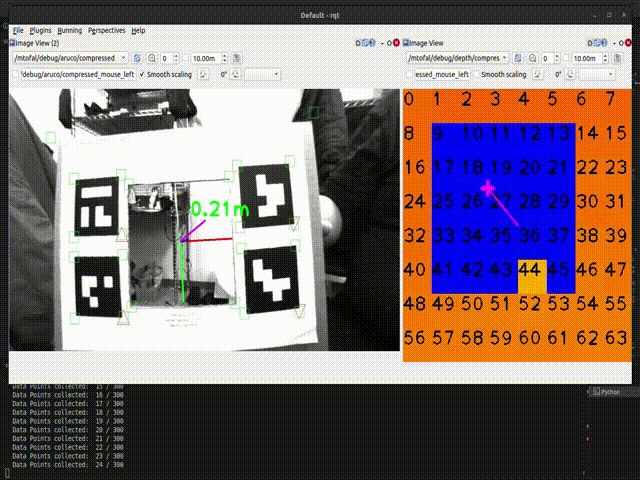

# mtofalib
ROS2 Package for 3D-2D correspendance orientation calibration of a Multi-zone ToF distance sensor (mtof) and a Monocular Camera.



## Method

A low-cost multi-zone time-of-flight distance sensor, such as VL53L5CX or VL53L8CX, has a very limited resolution of up to 8x8 pixels. Which made it very difficult to accurately estimate the relative pose when used in conjunction with a monocular camera.  By attaching the sensor to a camera, slight orientation misalignment of the mtof sensor and the camera is unavoidable and leads to significant misalignment in 3D-2D projection of the mtof zone centers in the image.

Existing calibration methods for pattern-based depth cameras or time-of-flight depth cameras are not applicable for such a low resolution. An alternative approach is to use a second global shutter NIR/IR camera with high FPS to directly detect the mtof's emitted infrared light and find it's homography in the target camera. However, it requires an additional camera and also require additional extrinsic calibration between the targeted camera and the said camera. The position offset of the two cameras also results in some degree of 3D-2D coressondance error.

This calibration method exploits a calibration target that can be easily replicate using basic materials such as cardboard boxes and a paper-printed AR markers. The relative orientation calibration is calculated from 3D-2D correspondence between the pose of the board center in the image estimated by AR markers and the pose of the board center estimated from depth data acquired from mtof. Relative orientation is solved with singular value decomposition (SVD) approach.

## Calibration target

The calibration pattern can be downloaded in [docs/calibration_pattern.pdf](https://github.com/sumborwonpob/mtofalib/blob/main/docs/calibration_pattern.pdf). The calibration target is a pattern of AR markers with a square hole in the middle.


Calibration target can be used in two ways, depending on the hardware:

* [Recommended] Board mode (with hole in the center covered): In case of wide FoV camera

* Hollow mode (with hole in the center): In special circumstances such as extremely wide FoV camera.

## Tested Environment and dependencies

Tested environment: Ubuntu 22.04, ROS 2 Humble Desktop, and OpenCV 4.5.4

Tested sensors: VL53L5CX and VL53L8CX

## Usage


Be sure to attach the mtof as close as possible to the camera center and measure the. The recommended distance is less than 2cm from the camera sensor centre. Calibration can also be done with distance longer than 2cm, but more error 2D image projection with longer distance.

Adjust all the necessary parameters in the [calibrator.py](https://github.com/sumborwonpob/mtofalib/blob/main/scripts/calibrator.py). Do colcon build to update the parameters.

### Use in native ROS 2 Humble

Install dependencies and clone repo

```
# Required for debug image publisher
sudo apt-get install ros-humble-compressed-image-transport

cd ros2_ws/src
git clone https://github.com/sumborwonpob/mtofalib.git --recurse-submodules
cd .. && colcon build --packages-select mtofalib
```
This package also provides a ROS2 interface that publishes VL53L5CX multi-zone distance sensor to ROS space which depends on the [VL53L5CX_I2C_DRIVER repo](https://github.com/sumborwonpob/VL53L5CX_I2C_DRIVER). The repo should be cloned along with this repo if you did not forget to put --recurse-submodules (yes, sometimes you forget, it happens). If you want to use a different sensor, please create your own publisher and publish it using [mtofalib/msgs/Mtof.msg](https://github.com/sumborwonpob/mtofalib/blob/main/msg/Mtof.msg) format.

```
# Don't forget to source
cd ros2_ws
source install/setup.bash

# Launch all nodes including UVC publisher and MToF publisher
ros2 launch mtofalib launch_all.py

# OR only run MToF publisher
ros2 run mtofalib mtof_publisher

# OR only run calibrator
ros2 run mtofalib calibrator.py
```
Open rqt image visualizer and subscribe to two compressed image topics to view the calibration image
```
/mtofal/debug/depth/compressed
/mtofal/debug/aruco/compressed
```

### Use with docker

Clone the repo to a workspace
```
mkdir mtofalib_ws
cd mtofalib_ws/src
git clone https://github.com/sumborwonpob/mtofalib.git --recurse-submodules
```

A dockerfile, build script, and run script is provided in the [docker folder](https://github.com/sumborwonpob/mtofalib/blob/main/docker/)

Be sure to [install docker engine](https://docs.docker.com/engine/install/) before using it.

Docker image can be built and run with
```
bash docker_build.sh
bash docker_run.sh

# If you need to connect docker on another terminal
bash docker_exec.sh
```
Build the workspace and run
```
# Build and source
source docker_inside_activate.sh
# Run everything
bash docker_inside_run_all.sh
# Other run scripts are prefixed docker_inside_*
```

## Calibration

### Using board mode

Generally, this mode is recomended.

Use the rigid calibration board without the hollow part in the middle. Move the board around in the depth image in both up-down and left-right direction. 

Alternatively, fix the board on a thin base such that the base is not visible much in the depth image, and move the camera-mtof module around.

* Try to keep the whole board in the depth image
* Minimize the visibility of your arm in the depth image as much as possible
* Keep the board size in the depth image roughly the same as shown in the video.



Move the board sufficiently until enough samples are collected. The graph showing calibrated result will be shown at the end. You can see the actual calibrated projected depth after closing the graph.

### Using hollow mode

In special circumstances such as extremely wide FoV camera with low resolution such that AR marker detection is difficult at long range, hollow mode is recommanded.

In this mode, calibration accuracy may be reduced.

Use the calibration target with hole in the middle uncovered, move the board around in the depth image such that:
* The whole hollow part is seen in the depth image.
* Make sure to minimize the visibility of the area outside the border of the board.



Move the board sufficiently until enough samples are collected. The graph showing calibrated result will be shown at the end. You can see the actual calibrated projected depth after closing the graph.

## How to use the calib result?

The calibration result provides extrinsic information of the MToF in the camera frame, rotation vector (rvec). Translation vector (tvec) is measured by hand and provided manually by the user.

The FoV and  and number of zones of the MToF is known, therefore we can calculate 3D point of each zone with the measured distance. Now we can project those 3D points to the image using [cv.projectPoints()](https://docs.opencv.org/4.5.4/d9/d0c/group__calib3d.html#ga1019495a2c8d1743ed5cc23fa0daff8c). Therefore, we then know the zone's homography in the image as seen below.


The part of code in the calibrator that does the projection [can be found here](https://github.com/sumborwonpob/mtofalib/blob/08ce0f3ed07e4fcd5bb4238c3c5615a09736612b/scripts/calibrator.py#L294).