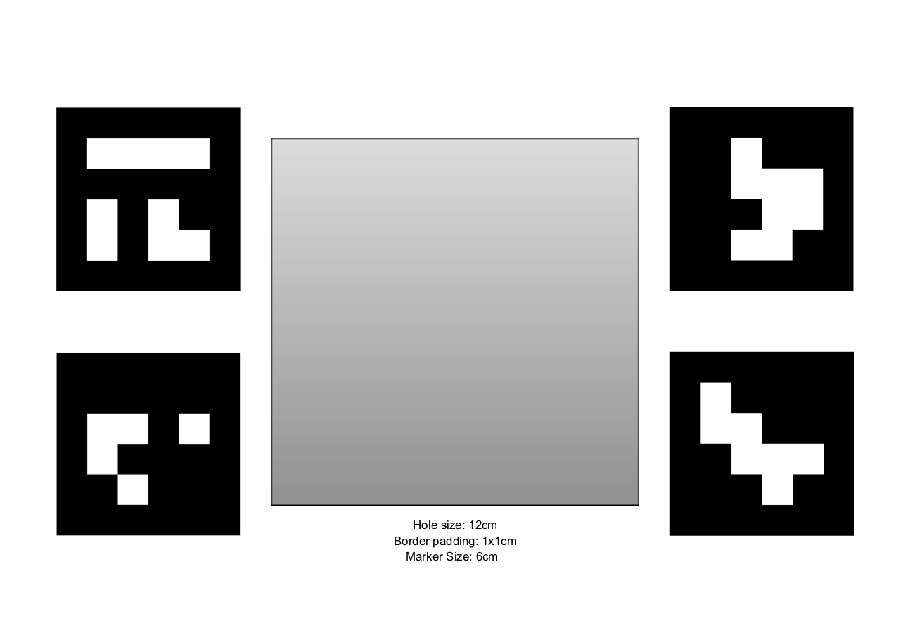
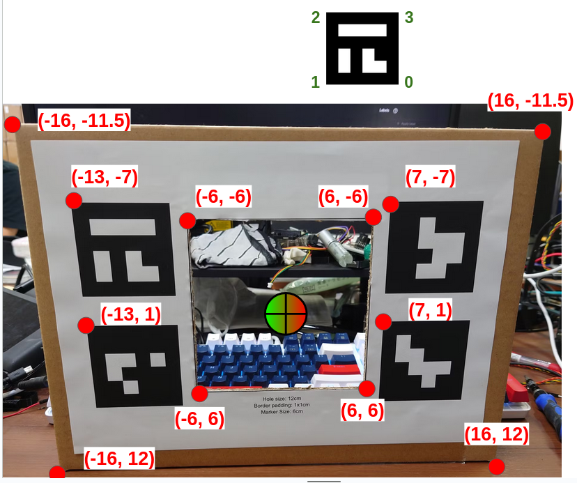
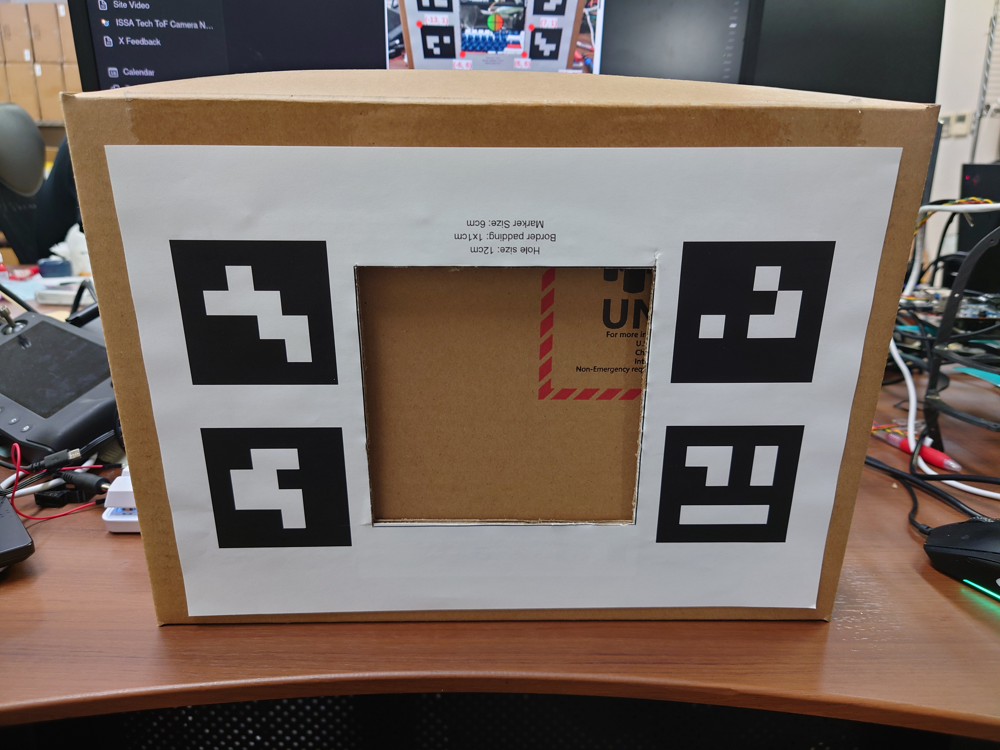
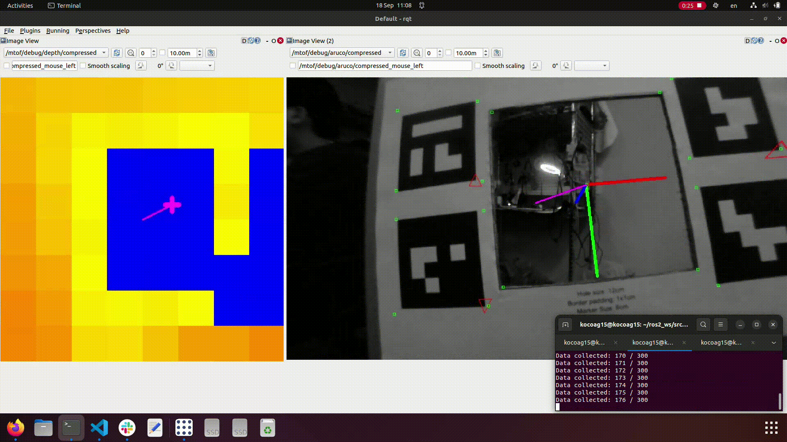

# mtofalib
ROS2 Package for 3D-2D correspendance orientation calibration of Multi-zone ToF distance sensor (mtof) and a Monocular Camera.

## Method

A low-cost multi-zone time-of-flight distance sensor, such as VL53L5CX or VL53L8CX, has a very limited resolution of up to 8x8 pixels. Which made it very difficult to accurately estimate the relative pose when used in conjunction with a monocular camera. Existing calibration methods for pattern-based depth cameras or time-of-flight depth cameras are not applicable for such a low resolution. By attaching the sensor to a camera, slight orientation misalignment of the mtof sensor and the camera is unavoidable and leads to significant misalignment in 3D-2D projection of the mtof zone centers in the image.

This calibration method exploits a calibration target with a specific shape but easy to replicate with basic materials such as cardboard boxes and a paper-printed AR markers. The angle calibration is calculated from 3D-2D correspondence between the pose of the board in the image estimated by AR markers and the pose of the board estimated from depth data acquired from mtof.

## Calibration target

The calibration pattern can be downloaded in [docs/calibration_pattern.pdf](https://github.com/sumborwonpob/mtofalib/blob/main/docs/calibration_pattern.pdf). The calibration target is a pattern of AR markers with a square hole in the middle.


The dimensions of the calibration target is printed on an A4 paper and attached to a cardboard box as shown in the image. A square hole is cut in the middle of the calibration target. The square hole is used during pitch/yaw calibration step.


The square hole is covered up by another cardboard sheet during roll calibration step.


## Installation and dependencies

Tested environment: Ubuntu 22.04, ROS 2 Humble Desktop, and OpenCV 4.5.4
```
# Required for debug image publisher
sudo apt-get install ros-humble-compressed-image-transport

cd ros2_ws/src
git clone https://github.com/sumborwonpob/mtofalib.git --recurse-submodules
cd .. && colcon build --packages-select mtofalib
```
This package also provides a ROS2 interface that publishes VL53L5CX multi-zone distance sensor to ROS space. It depends on the [VL53L5CX_I2C_DRIVER repo](https://github.com/sumborwonpob/VL53L5CX_I2C_DRIVER) which should be cloned along with this repo if you did not forget to put --recurse-submodules (yes, sometimes you forget, it happens). If you want to use a different sensor, please create your own publisher and publish it using [mtofalib/msgs/Mtof.msg](https://github.com/sumborwonpob/mtofalib/blob/main/msg/Mtof.msg) format.

## Usage

Be sure to attach the mtof as close as possible to the camera centre. The recommended distance is less than 2cm from the camera sensor centre.

Adjust all the necessary parameters in the [calibrator.py](https://github.com/sumborwonpob/mtofalib/blob/main/scripts/calibrator.py) and do concol build to update the parameters. Then:

```
ros2 run mtofalib mtof_publisher
ros2 run mtofalib calibrator.py
```
Open rqt image visualizer and subscribe to two compressed image topics
```
/mtofal/debug/depth/compressed
/mtofal/debug/aruco/compressed
```
### Roll calibration

Cover up the square hole in the calibration target. Make sure that only the upper edge is seen in the mtof as shown below. Tilt the calibration target around in the roll direction. 

Try such that the left and right edge of the calibration target is not seen in the depth image and only the upper edge is seen, or else CoM calculation may be wrong.


### Pitch/Yaw calibration

Open up the square hole in the calibration target. Try to include the whole square hole in the mtof depth image. Try to hold the target close to the mtof and the camera such that outer edge does not reflect in the mtof depth image. Since the hole center in the depth image is calculated from clustering, if the whole hole is not in the depth frame, or if the area behind the outer edge of the target is seen, the center of mass calculation may be inaccurate.

